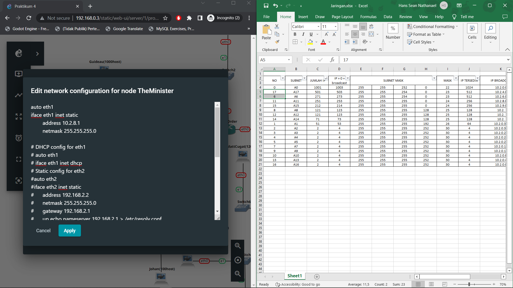

# Lapres Jarkom Kelompok A06

## Anggota Kelompok

1. Hans Sean Nathanael - 5025201019
2. Mohammad Fany Faizul Akbar - 5025201225
3. Fadel Pramaputra Maulana - 5025201260

## VLSM
VLSM dikerjakan pada GNS3

### Pembagian Subnet
Berikut adalah pembagian kode subnet


### Perhitungan Subnet
Berikut adalah tabel perhitungan pembagian IP


### Tree Pembagian IP
Dari hasil tabel perhitungan dibuat tree pembagian IP yang hasilnya adalah berikut


### Penghubungan Node

Untuk setiap node dikonfigurasi address-nya beserta gateway. Untuk setiap router, dijalankan command

``` iptables -t nat -A POSTROUTING -o <eth yang terhubung> -j MASQUERADE ``` pada setiap port yang terhubung pada sebuah node

Kemudian juga menjalankan command

``` route add -net <NID> netmask <net mask> gw <gateway routing> ``` untuk setiap destinasi jaringan subnet yang perlu dihubungkan

## Kendala

GNS3 tidak dapat terhubung dengan internet walaupun sudah dijalankan iptables dan memasukkan nameserver 192.168.122.1 pada node dan router.

## Dokumentasi

